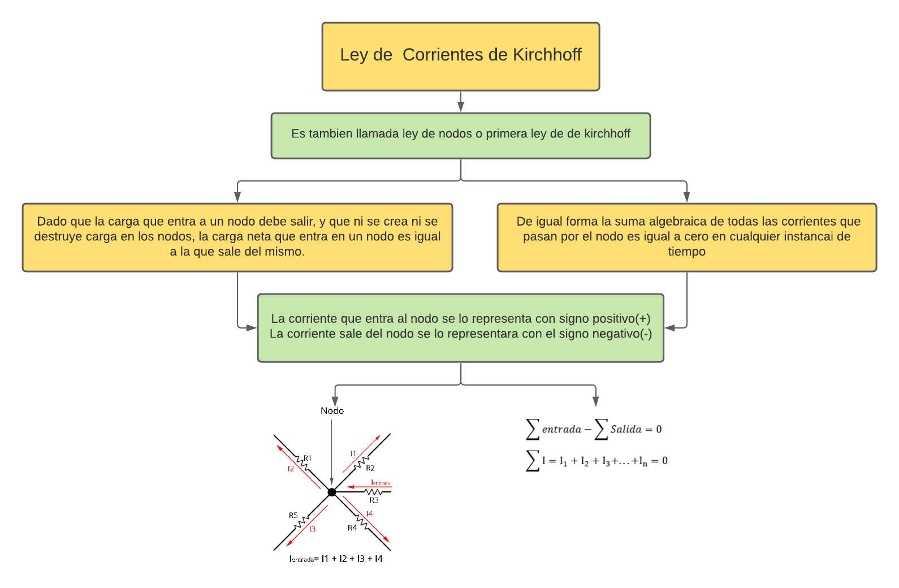
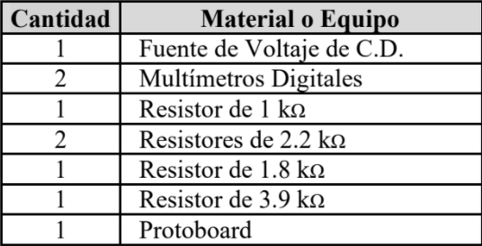
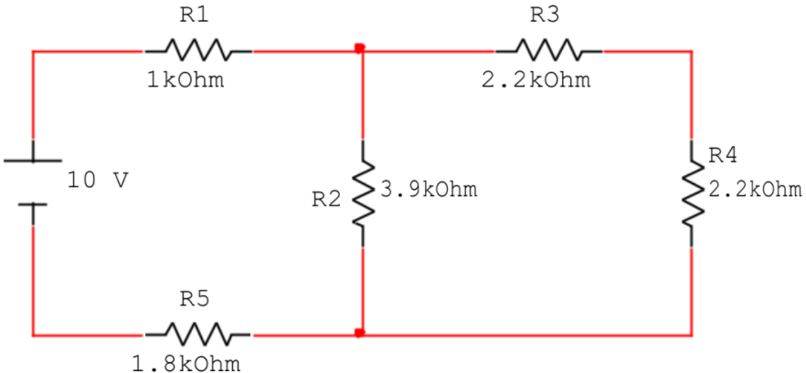
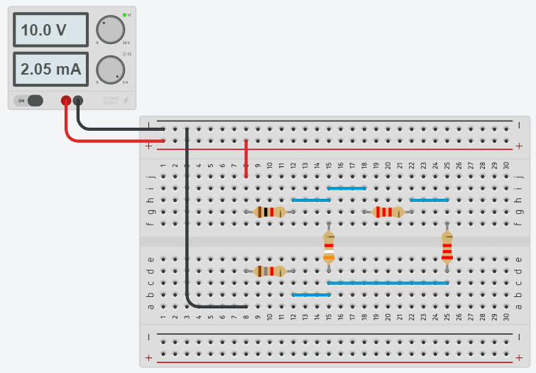
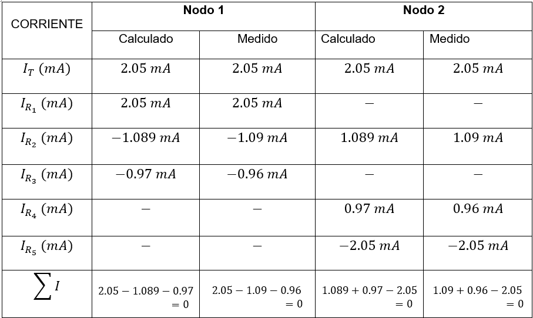

# Informe de laboratorio N°1
**Integrantes:**

Christian Bonifaz, Jean Jacome, Kevin Sandoval

**NRC:** 5406

**Docente:** Ing. Darwin Alulema

**Tema:** LEYES DE KIRCHHOFF
#### 1. OBJETIVOS (BONIFAZ)

- Comprender y analizar mediante la simulacion de un circuito y la medicion respectiva de los valores de voltaje e intensidad de cada uno de los componentes, para demostrar la Ley de Kirchhoff de voltajes y la ley de Kirchhoff de corrientes presentes en el circuito.

- Obtener mediante calculos los valores teoricos de voltaje e intensidad de los componentes del cicuito, para hallar el porcentaje de error junto con los resultados medidos.

- Comparar los datos obtenidos analiticamente con los resultados medidos en el circuito y verificar si cumple con las leyes de Kirchhoff previamente conocidas. 

#### 2. MARCO TEÓRICO (BONIFAZ Y JACOME)
**Ley de Kirchhoff de Corrientes** (JACOME)

**Ley de Kirchhoff de Voltaje** (BONIFAZ)

#### 3. EXPLICACIÓN DEL PROCEDIMIENTO
3.1 El equipo requerido y utilizado para la elaboracion del circuito es el siguiente:

3.2 Armar el circuito que se muestra en la siguiente figura,en la herramienta tinkercad para posteriormente simularlo.

 

3.3 Simular y medir el voltaje y corriente en cada uno de los elementos del circuito y anotar los resultados de las mediciones en la tabla 1.1.

3.4 Verificar si se cumple la Ley de Kirchhoff de Voltajes en cada trayectoria cerrada, considerando las elevaciones de voltaje con signo positivo y las caídas de voltaje con signo negativo. Anotar los resultados en la tabla 1.2.

 

3.5 Verificar si se cumple la Ley de Kirchhoff de Corrientes en cada nodo, tomando con signo positivo las corrientes que entran al nodo y con signo negativo las que salen del nodo. Anotar los resultados en la tabla 1.3.

3.6 Comparar los resultados medidos con los valores obtenidos al analizar el circuito analíticamente y concluya al respecto.

#### 4. RESPUESTA A INTERROGANTES Y CALCULO DEL ERROR (JACOME Y SANDOVAL)

Se redujo el circuito para poder hacer un circuito mas simple 

Sumamos las resistencias R3 Y R4 porque están en serie:
R3,4=4.4KΩ
Paralelo con la resistencia de R3,4 con la R2

Aplicamos la ley de tensiones de Kirchhoff, con la cual podremos despear la corriente que pasa por el circuito reducido.

RT=1 KΩ+2.067 KΩ +1.8 KΩ
RT= 4.867KΩ

**APLICAMOS DIVISOR DE CORRIENTE **

Ya conociendo la corriente que circula por el circuito reducido, tenemos que volver a extender el circuito y aplicar la ley de división de corriente. Ya que para obtener el voltaje que circula por las resistencias 3y4 tenemos que saber la corriente que pasan por las resistencias.

Y una vez obtenido la corriente que pasa por las resistencias 3 y 4 ya podemos aplicar la ley de ohm para conseguir el voltaje de las resistencias.

- **TRAYECTORIA 1**

- **TRAYECTORIA 2**

- **TRAYECTORIA 3**

10V=2.054+2.123V+2.123V+3.697V
10V=9.997V

#### 5. VIDEO
#### 6. CONCLUSIONES (SANDOVAL)
•	Concluimos que en la mayoría de los casos los valores obtenidos durante la práctica presentan una alta precisión con respecto a los valores obtenidos mediante el uso de las leyes de Kirchhoff y el uso de programas computacionales que permitan simular los circuitos implementados.

•	Concluimos que la teoría física como lo son las leyes de Kirchhoff permite a la humanidad modelar la realidad de una de las tres fuerzas fundamentales del universo como lo es la fuerza electro débil en modelos con gran precisión, afirmación que puedo ser comprobada durante la presente práctica.

•	Los datos recopilados durante la práctica se asemejan a los valores obtenidos a través de los respectivos cálculos, pero en ciertas ocasiones, la diferencia entre los datos varía en una gran escala, convirtiéndose en datos dudosos, para despejar errores.

#### 7. BIBLIOGRAFÍA
